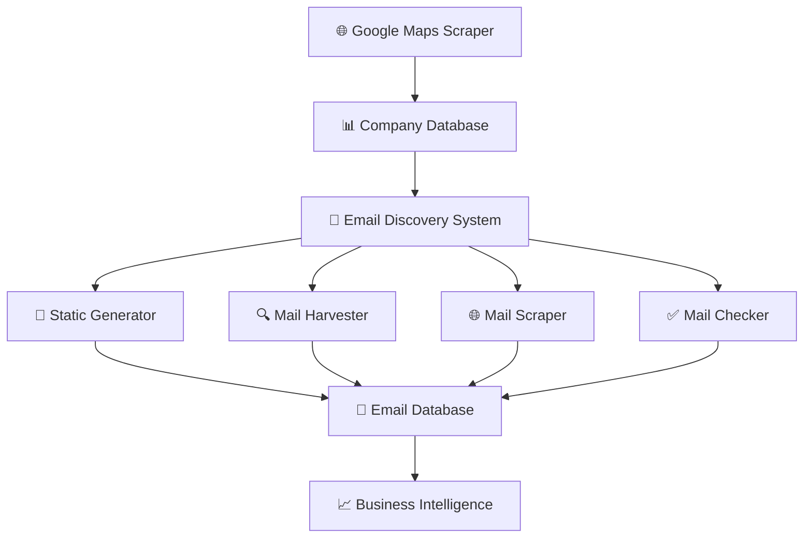

# 🌍 **GMap** - Professional Google Maps Scraper & Email Discovery Platform

<div align="center">


**🚀 Automated Google Maps scraping + Professional email discovery system**

*Discover companies worldwide and find their professional email addresses using multiple advanced techniques*

</div>

---

## 📋 **Table of Contents**

- [🎯 What is GEO_MAIL?](#-what-is-geo_mail)
- [✨ Key Features](#-key-features)
- [🏗️ Architecture](#️-architecture)
- [🚀 Quick Start](#-quick-start)
- [📧 Email Discovery Addons](#-email-discovery-addons)
- [⚙️ Configuration](#️-configuration)
- [📊 Usage Examples](#-usage-examples)
- [🔧 Advanced Usage](#-advanced-usage)
- [📁 Project Structure](#-project-structure)
- [🤝 Contributing](#-contributing)

---

## 🎯 **What is GEO_MAIL?**

**GEO_MAIL** is a comprehensive business intelligence platform that combines **automated Google Maps scraping** with **advanced email discovery techniques** to help you build targeted business contact databases.

### 🔍 **Core Functionality:**

1. **🗺️ Google Maps Scraping** - Automatically discovers companies from Google Maps searches
2. **📧 Email Discovery** - Uses multiple sophisticated methods to find professional email addresses
3. **✅ Email Validation** - Verifies email deliverability and reachability
4. **📊 Data Management** - Stores and organizes data in a professional SQLite database

### 🎯 **Perfect For:**
- 🏢 **Business Development** - Building prospect lists
- 📈 **Sales Teams** - Finding decision-maker contacts  
- 🔍 **Market Research** - Analyzing company landscapes
- 📧 **Email Marketing** - Creating targeted campaigns
- 🌐 **Lead Generation** - Discovering new business opportunities

---

## ✨ **Key Features**

### 🌍 **Global Company Discovery**
- **Multi-country support** - Search across 25+ countries
- **Smart query templates** - Customizable search patterns
- **Parallel processing** - Fast concurrent scraping
- **Rate limiting protection** - Avoid getting blocked

### 📧 **Advanced Email Discovery**
- **4 Discovery Methods** - Static, Harvester, Scraper, Checker
- **Confidence scoring** - Prioritize high-quality emails
- **Duplicate prevention** - Smart deduplication
- **Professional patterns** - Industry-standard email formats

### 🛡️ **Enterprise-Grade Features**
- **Professional logging** - Detailed audit trails
- **Error recovery** - Automatic retry mechanisms
- **Configuration management** - Flexible settings
- **Modular architecture** - Easy to extend and customize

---

## 🏗️ **Architecture**



### 🔧 **Core Components:**

| Component | Purpose | Location |
|-----------|---------|----------|
| **Main Scraper** | Google Maps automation | [`src/main.py`](src/main.py) |
| **Browser Handler** | Playwright management | [`modules/browser_handler.py`](modules/browser_handler.py) |
| **Database Manager** | SQLite operations | [`modules/database_manager.py`](modules/database_manager.py) |
| **Email Finder** | Addon coordination | [`modules/email_finder.py`](modules/email_finder.py) |
| **Config Manager** | Settings management | [`modules/config_manager.py`](modules/config_manager.py) |

---

## 🚀 **Quick Start**

### 📦 **1. Installation**

```bash
# Clone the repository
git clone <repository-url>
cd geo_mail

# Run setup script (creates virtual environment if desired)
chmod +x setup.sh
./setup.sh

# Or manual installation
pip install -r requirements.txt
playwright install
```

### ⚙️ **2. Configuration**

```bash
# Copy example configuration
cp config/config.example.ini config/config.ini

# Edit configuration
nano config/config.ini
```

**Essential settings in [`config/config.ini`](config/config.ini):**
```ini
[Search]
search_query_templates = tech companies in ${country}
country = Australia, Canada, United Kingdom, United States

[EmailFinders]
enabled_methods = static,harvester,scraper
run_inline = true
static_enabled = true
```

### 🏃 **3. Run Your First Scrape**

```bash
# Start scraping
python src/main.py

# Monitor progress in logs/
tail -f logs/latest/all.log
```

---

## 📧 **Email Discovery Addons**

GEO_MAIL features a powerful modular email discovery system with 4 specialized addons:

### 📝 **Static Email Generator**
> **Generates common professional email patterns**

**📍 Location:** [`addons/static-generator/`](addons/static-generator/)

**🎯 What it does:**
- Creates standard business email patterns (info@, contact@, sales@, etc.)
- Uses intelligent pattern selection based on company type
- Configurable confidence scoring for each pattern type

**⚙️ Configuration:**
```ini
[EmailFinders]
static_enabled = true
static_confidence_info = 0.95
static_confidence_contact = 0.90
static_confidence_sales = 0.80
```

**🚀 Standalone Usage:**
```bash
cd addons/static-generator
python main.py --all-companies --limit 100
python main.py --company-id 123
```

**📊 Example Output:**
```
Generated 6 emails for TechCorp Ltd:
  ✅ info@techcorp.com (confidence: 0.95)
  ✅ contact@techcorp.com (confidence: 0.90)
  ✅ sales@techcorp.com (confidence: 0.80)
```

---

### 🔍 **Mail Harvester (OSINT)**
> **Discovers emails using open-source intelligence**

**📍 Location:** [`addons/mail-harvester/`](addons/mail-harvester/)

**🎯 What it does:**
- Uses theHarvester tool for OSINT email discovery
- Searches multiple sources (Bing, DuckDuckGo, Yahoo, etc.)
- Finds emails from public databases and search engines

**⚙️ Configuration:**
```ini
[EmailFinders]
harvester_enabled = true
harvester_sources = bing,duckduckgo,yahoo,crtsh
harvester_confidence = 0.8
harvester_timeout = 300
```

**🚀 Standalone Usage:**
```bash
cd addons/mail-harvester
python main.py --all-companies --limit 50
python main.py --company-id 123 --sources bing,yahoo
```

**📊 Example Output:**
```
Harvested 3 emails for TechCorp Ltd:
  ✅ john.doe@techcorp.com (source: bing, confidence: 0.8)
  ✅ support@techcorp.com (source: duckduckgo, confidence: 0.8)
```

---

### 🌐 **Mail Scraper (Website Crawler)**
> **Extracts emails directly from company websites**

**📍 Location:** [`addons/mail-scraper/`](addons/mail-scraper/)

**🎯 What it does:**
- Crawls company websites to extract email addresses
- Configurable crawling depth and limits
- Highest confidence emails (found on official sites)

**⚙️ Configuration:**
```ini
[EmailFinders]
scraper_enabled = true
scraper_depth = 1
scraper_confidence = 0.9
scraper_limit_emails = 20
```

**🚀 Standalone Usage:**
```bash
cd addons/mail-scraper
python main.py --all-companies --limit 25
python main.py --company-id 123 --depth 2
```

**📊 Example Output:**
```
Scraped 7 emails from techcorp.com:
  ✅ ceo@techcorp.com (confidence: 0.9)
  ✅ hr@techcorp.com (confidence: 0.9)
  ✅ partnerships@techcorp.com (confidence: 0.9)
```

---

### ✅ **Mail Checker (Email Validation)**
> **Validates email deliverability and reachability**

**📍 Location:** [`addons/mail-checker/`](addons/mail-checker/)

**🎯 What it does:**
- Validates email syntax and deliverability
- Checks MX records and SMTP connectivity
- Identifies disposable and role-based emails

**⚙️ Configuration:**
```ini
[EmailChecker]
enabled = true
api_endpoint = http://localhost:8080/v0/check_email
batch_size = 200
max_workers = 10
```

**🚀 Standalone Usage:**
```bash
cd addons/mail-checker
python main.py --all-emails --limit 1000
python main.py --email john@example.com
python main.py --source static --limit 500
```

**📊 Example Output:**
```
Checked 150 emails:
  ✅ 120 deliverable
  ❌ 20 undeliverable  
  ⚠️ 10 risky
```

---

## ⚙️ **Configuration**

### 📁 **Configuration Files**
- **Main Config:** [`config/config.ini`](config/config.ini) - Your active settings
- **Example Config:** [`config/config.example.ini`](config/config.example.ini) - Complete reference

### 🔧 **Key Configuration Sections**

#### 🌐 **Search Configuration**
```ini
[Search]
search_query_templates = tech companies in ${country}
country = Australia, Canada, United Kingdom
max_companies_per_query = 100
```

#### 📧 **Email Discovery Settings**
```ini
[EmailFinders]
enabled_methods = static,harvester,scraper
run_inline = true
check_inline = false

# Confidence scores (0.0 to 1.0)
static_confidence_info = 0.95
harvester_confidence = 0.8
scraper_confidence = 0.9
```

#### 🎭 **Browser Settings**
```ini
[Playwright]
headless = false
parallel_query_count = 5
```

### 📖 **Complete Configuration Guide**
See [`config/config.example.ini`](config/config.example.ini) for detailed documentation of all available options.

---

## 📊 **Usage Examples**

### 🎯 **Basic Company Discovery**
```bash
# Scrape tech companies globally
python src/main.py

# Monitor progress
tail -f logs/latest/all.log
```

### 📧 **Email Discovery Workflows**

**Run all email discovery methods:**
```bash
# Automatic (inline with scraping)
python src/main.py  # Emails found automatically

# Manual (separate addon runs)
cd addons/static-generator && python main.py --all-companies
cd addons/mail-harvester && python main.py --all-companies  
cd addons/mail-scraper && python main.py --all-companies
```

**Target specific companies:**
```bash
# Generate emails for specific company
python addons/static-generator/main.py --company-id 123

# Harvest emails for multiple companies
python addons/mail-harvester/main.py --company-id 123,456,789
```

### ✅ **Email Validation**
```bash
# Validate all discovered emails
python addons/mail-checker/main.py --all-emails

# Validate specific source emails
python addons/mail-checker/main.py --source static --limit 500
```

---

## 🔧 **Advanced Usage**

### 🔄 **Addon Enable vs Run Inline Logic**

| Setting | Behavior |
|---------|----------|
| `enabled=true, run_inline=true` | ✅ Runs automatically with scraping |
| `enabled=true, run_inline=false` | ⚠️ Available but runs separately only |
| `enabled=false` | ❌ Completely disabled |

### 📊 **Database Schema**

**Companies Table:**
- Basic company information (name, address, website, etc.)
- Email discovery tracking (methods used, completion status)

**Emails Table:**
- Email addresses with source attribution
- Confidence scores and validation results
- Timestamps and metadata

### 🔍 **Logging System**

Each addon maintains separate logs in timestamped directories:
```
addons/static-generator/logs/2025-07-13_143022/
├── all.log         # Complete log
├── info.log        # Info messages
├── warning.log     # Warnings
└── error.log       # Errors
```

---

## 🤝 **Contributing**

We welcome contributions! Please see our contributing guidelines for details on:

- 🐛 **Bug Reports** - Help us improve
- ✨ **Feature Requests** - Suggest new capabilities  
- 🔧 **Code Contributions** - Submit pull requests
- 📖 **Documentation** - Improve our guides

---

## 🛠️ **Troubleshooting**

### 🔧 **Common Issues**

**❌ "theHarvester binary not found"**
```bash
# Install theHarvester in addon directory
cd addons/mail-harvester/bin
git clone https://github.com/laramies/theHarvester.git
```

**❌ "email_extractor binary not found"**
```bash
# Install email extractor in addon directory
cd addons/mail-scraper/bin
# Download from: https://github.com/kevincobain2000/email_extractor
```

**❌ "Config file not found"**
```bash
# Ensure config exists
cp config/config.example.ini config/config.ini
```

### 📊 **Performance Tips**

- **Reduce `parallel_query_count`** if getting rate limited
- **Increase `batch_size`** for faster email processing
- **Use `headless=true`** for production environments
- **Set appropriate `timeout`** values for your connection

### 🔍 **Debugging**

```bash
# Enable debug logging
# In config/config.ini:
[Logging]
console_level = DEBUG

# Check specific addon logs
tail -f addons/static-generator/logs/latest/debug.log
```

---

## 📈 **Performance & Scaling**

### ⚡ **Optimization Settings**

```ini
[Playwright]
parallel_query_count = 8        # Increase for faster scraping
headless = true                 # Reduce resource usage

[EmailFinders]
static_max_emails = 12          # More email patterns
harvester_limit_per_source = 200 # More OSINT results

[EmailChecker]
batch_size = 500               # Larger validation batches
max_workers = 20               # More concurrent workers
```

### 📊 **Expected Performance**

| Operation | Speed | Notes |
|-----------|-------|-------|
| **Company Discovery** | 50-100/min | Depends on query complexity |
| **Static Email Generation** | 1000+/min | Very fast pattern matching |
| **Email Harvesting** | 10-50/min | Limited by OSINT sources |
| **Website Scraping** | 20-100/min | Depends on website complexity |
| **Email Validation** | 200-1000/min | Depends on API performance |

---

## 🔐 **Security & Privacy**

### 🛡️ **Data Protection**
- **Local Storage** - All data stored locally in SQLite
- **No Cloud Dependencies** - Complete offline operation
- **Configurable Retention** - Control data lifecycle
- **Audit Trails** - Complete logging of all operations

### ⚖️ **Ethical Usage**
- **Respect robots.txt** - Honor website crawling policies
- **Rate Limiting** - Avoid overwhelming target servers
- **GDPR Compliance** - Handle personal data responsibly
- **Terms of Service** - Respect platform usage terms

### 🔒 **Best Practices**
- Use reasonable delays between requests
- Implement proper error handling
- Monitor for rate limiting responses
- Respect website terms of service

---

## 🆘 **Support & Community**

### 📞 **Getting Help**
- 📖 **Documentation** - Check [`config/config.example.ini`](config/config.example.ini)
- 🐛 **Issues** - Report bugs via GitHub Issues
- 💬 **Discussions** - Join community discussions
- 📧 **Email** - Contact maintainers directly

### 🤝 **Contributing**
- 🍴 **Fork** the repository
- 🌿 **Create** a feature branch
- ✅ **Test** your changes
- 📝 **Submit** a pull request

### 📋 **Roadmap**
- 🔄 **Real-time Processing** - Live email discovery
- 🌐 **Web Interface** - GUI for non-technical users
- 📊 **Analytics Dashboard** - Advanced reporting
- 🔌 **API Integration** - RESTful API endpoints
- 🤖 **AI Enhancement** - Machine learning improvements

---

<div align="center">

**🌟 Star this project if you find it useful!**

*Built with ❤️ for the business intelligence community*

**[⬆️ Back to Top](#-geo_mail---professional-company-data--email-discovery-platform)**

</div>
